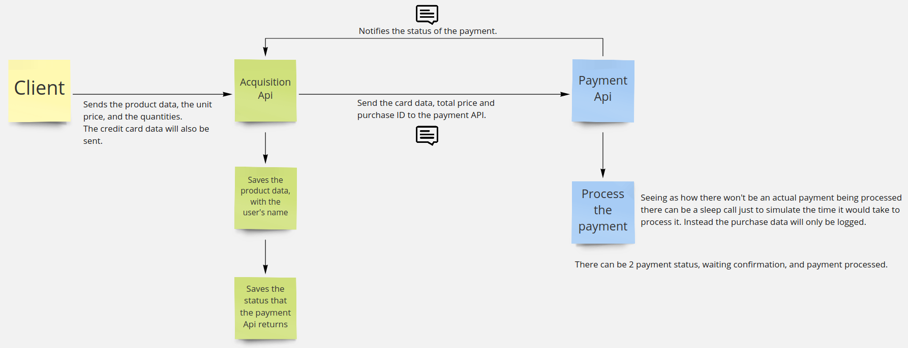

# RabbitMQ-Spring-PoC
This is a simple project with 2 applications, the acquisition and payment applications, both of them will be producers and consumers of RabbitMQ.

I'm using this project to study how to implement consumers and producers using Spring, as I study the functionalities of RabbitMQ.

This is a simple flowchart, of how the applications communicate with each other:
